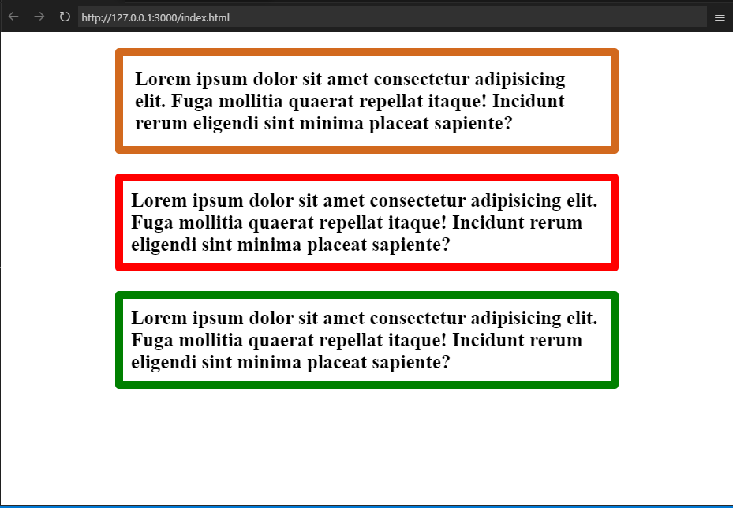

<!-- START doctoc generated TOC please keep comment here to allow auto update -->
<!-- DON'T EDIT THIS SECTION, INSTEAD RE-RUN doctoc TO UPDATE -->
**Table of Contents**  

- [CSS BOX MODEL DOCUMENTATION](#css-box-model-documentation)
- [Lets explain the content Above:](#lets-explain-the-content-above)
- [How the CSS Box Model Works](#how-the-css-box-model-works)
    - [Total Width Calculation =](#total-width-calculation-)
    - [Total Height Calculation =](#total-height-calculation-)
- [Examples of Box models in CSS](#examples-of-box-models-in-css)
  - [This example illustrates the Box Model by implementing the various properties.](#this-example-illustrates-the-box-model-by-implementing-the-various-properties)
      - [CSS CODE](#css-code)
      - [HTML](#html)
      - [RESULT](#result)

<!-- END doctoc generated TOC please keep comment here to allow auto update -->

## CSS BOX MODEL DOCUMENTATION
The box model in CSS is a set of rules that determine how your web page is rendered on the internet. In this model, a rectangular box is generated for HTML elements. Each is laid out according to its dimension, type, positioning, relationship to other elements, and external factors like viewport size. This box consists of content, padding, a border, and margin.
 The image below illustrates the box model:

 

 ## Lets explain the content Above:
* **Content :** The actual data in text, images, or other media forms can be sized using the width and height property.
* **Padding :** Padding is used to create space around the element, inside any defined border.
* **Border :** The border is used to cover the content & any padding, & also allows setting the style, color, and width of the border.
* **Margin :** Margin is used to create space around the element ie., around the border area.


1) **Content :**  Its dimensions are content width and content height. When specified, the width and height attributes determine the content edge or perimeter of the content box. Often, the width and height aren't specified, so the rendered content determines the content edge. In other words, the content area is only as wide and tall as it needs to be to hold the content, which might be as little as one word. If the element is a block element, then the content edge can also be set with the min-width, max-width, min-height, and max-height properties.

1) **Padding :** Padding is the space between the border and content of an element. Padding is important in web design because it helps make content more visible and readable.An element's padding can be defined with the following properties: padding-top, padding-bottom, padding-left, padding-right, or the shorthand property padding.

1) **Border :**  The border property lets us add and style a line around the content padding area. This line's thickness, color, and style can be defined by the border-width, border-color, and border-style properties, or you can use the shorthand border property to define all three. Border-style values include solid, dotted, dashed, double, groove, ridge, and none.The dimensions of the border area are the border-box width and border-box height. When specified, the width and height attributes determine the perimeter of the border area. If the box-sizing property is set to border-box, you can define the border size with min-width, max-width, min-height, and max-height.

1) **Margin :** The margin is the empty space separating the element from its neighbors and the outermost layer of the CSS box model. Its dimensions are the margin-box width and the margin-box height.
Its size can be defined by the following properties: the margin-left, margin-right, margin-top, margin-bottom properties, or the shorthand margin property.

## How the CSS Box Model Works

When setting the width and height properties for an element, we’re mainly adjusting the content area. However, to calculate the full size of the element, we need to consider padding and borders also.

While setting the width and height properties of an element with CSS, we have only set the width and height of the content area. We need to add padding and borders in order to calculate the full size of an element. Although margin affects the total area an element takes on the page but it is not considered to be a part of the actual size of the box as margins show peculiar behaviors like margin collapsing.
Consider the following CSS code:

```CSS
h1{
    width: 70px;
    height: 60px;
    margin: 0;
    border: 2px solid black;
    padding: 5px;

}

```
#### Total Width Calculation = 
Total element width = width + left padding + right padding + left border + right border

*Total element width = 70 + 10 + 4 = 80px*

#### Total Height Calculation = 
Total element height = Height + top padding + bottom padding + top border + bottom border

*Total element height = 60 + 10 + 4 = 74px*

## Examples of Box models in CSS

### This example illustrates the Box Model by implementing the various properties.

##### CSS CODE

```CSS
*{
    border: 0;
    padding: 0;
    box-sizing: border-box;
}
.div-1{
    font-size: 25px;
    font-weight: bold;
    border: 10px solid gray;
    margin-top: 20px;
    margin-bottom: 25px;
    margin-left: auto;
    margin-right: auto;
    padding: 15px;
    border-radius: 5px;
    border-color: chocolate;
    width:70%;

}
.div-2{
    font-size: 25px;
    font-weight: bold;
    border: 10px solid gray;
    margin-top: 10px;
    margin-bottom: 25px;
    margin-left: auto;
    margin-right: auto;
    padding: 10px;
    border-radius: 5px;
    border-color: red;
    width:70%;

}
.div-3{
    font-size: 25px;
    font-weight: bold;
    border: 10px solid gray;
    margin-top: 20px;
    margin-bottom: 25px;
    margin-left: auto;
    margin-right: auto;
    padding: 10px;
    border-radius: 5px;
    border-color: green;
    width:70%;

}


```

##### HTML 
```HTML
<!DOCTYPE html>
<html lang="en">
<head>
    <meta charset="UTF-8">
    <meta name="viewport" content="width=device-width, initial-scale=1.0">
    <title>CSS BOX MODEL</title>
    <link rel="stylesheet" href="/index.css">
</head>
<body>
<div class = "div-1">
    Lorem ipsum dolor sit amet consectetur
    adipisicing elit. Fuga mollitia quaerat
     repellat itaque! Incidunt
    rerum eligendi sint minima placeat sapiente?
</div>

<div class = "div-2">
    Lorem ipsum dolor sit amet consectetur
    adipisicing elit. Fuga mollitia quaerat
    repellat itaque! Incidunt
    rerum eligendi sint minima placeat sapiente?
</div>

<div class = "div-3">
    Lorem ipsum dolor sit amet consectetur
    adipisicing elit. Fuga mollitia quaerat
    repellat itaque! Incidunt
    rerum eligendi sint minima placeat sapiente?
</div>
</body>
</html>
```

##### RESULT



The CSS Box Model is crucial because it defines how elements are laid out on a web page. It consists of content, padding, border, and margin. Understanding this model helps web developers create consistent layouts, control spacing, and manage element dimensions. By mastering the box model, you can design responsive and visually appealing websites. 


